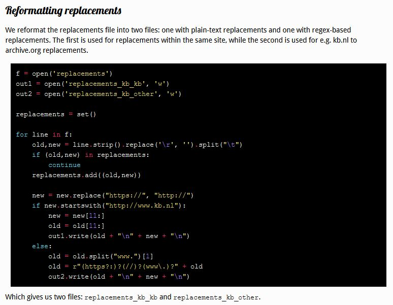

<table width="100%" border="0"><tr><td align="left">
<a href="https://kbnlwikimedia.github.io/tools/index.html"><< Back to tools and scripts index</a>
</td><td align="right">
<a href="https://github.com/KBNLwikimedia/GLAMorousToHTML" target="_blank">>> To the Github repo of this page</a>
</td></tr></table>

# Wikimedia KB URL replacement
*Code, scripts and stories about replacing outdated or non-persistent URLs of KB services in Wikipedia, Wikimedia Commons and Wikidata*

Read the article *[Making references to Dutch newspapers in Wikipedia more sustainable](https:kbnlwikimedia.github.io/WikimediaKBURLReplacement/stories/Making%20references%20to%20Dutch%20newspapers%20in%20Wikipedia%20more%20sustainable.html)* to understand why and how the KB replaces outdates URLs in Wikipedia.

* Folder *[ScriptsMerlijnVanDeen](ScriptsMerlijnVanDeen)*
  - The technique for replacing URLs is detailed in [this blogpost](https://web.archive.org/web/20200522204706/https://merlijn.vandeen.nl/2015/kb-replace-dead-links.html) by Merlijn van Deen. See the 4 screenshot below.
   - The Python scripts and [PAWS](https://wikitech.wikimedia.org/wiki/PAWS) commands for this method are available [from this folder](ScriptsMerlijnVanDeen/scripts)
   
<kbd></kbd>
<kbd></kbd>
<kbd></kbd>
<kbd></kbd>

* Folder *[GvN](GvN)* : Pywikibot commands for [PAWS](https://wikitech.wikimedia.org/wiki/PAWS) to replace links to Geheugen van Nederland (GvN) in Wikipedia based on [this example](https://www.mediawiki.org/wiki/Manual:Pywikibot/PAWS#A_real_script_example)

* Folder *[ScriptsHayKranen_KrantenKB](ScriptsHayKranen_KrantenKB)* : two Pyton scripts to replace URLs of newspapers in Delpher. Not yet worked with.

A Jypyter notebooks ([PAWS](https://wikitech.wikimedia.org/wiki/PAWS)) implementation of these scripts is available from https://paws-public.wmflabs.org/paws-public/User:OlafJanssenBot/WikipediaURLReplacement/
