## Making references to Dutch newspapers in Wikipedia more sustainable ##

Olaf Janssen, 8 June 2020

*Dutch Wikipedia contains some 20.000 citations to Delpher, a digital historical newspaper archive in the Netherlands. Many of those URLs are sustainable, but until recently Dutch Wikipedia also contained thousands of non-future-proof links to Delpher. In this article I'll show how I found these links and replaced them with persistent URLs, and what the benefits of this search-and-replace operation are.*

*********
### Key players: Delpher and KB
To understand the rest of this post, I'll start with a short introduction of the two key players:  

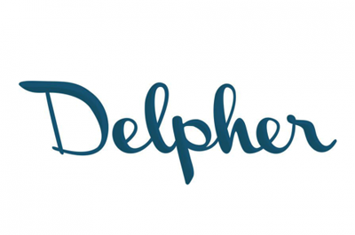 [Delpher](https://www.delpher.nl) is a website containing over 100 million full-text digitized pages not only from Dutch [historical newspapers](https://www.delpher.nl/nl/kranten), but also from [books](https://www.delpher.nl/nl/boeken) and [periodicals](https://www.delpher.nl/nl/tijdschriften). In this article I'll focus on the newspapers in this archive.    
The [Koninklijke Bibliotheek](https://www.kb.nl) (KB) is the national library of the Netherlands. Delpher is a services operated by the KB.    
*********

### Finding Delpher links in Wikipedia, Part 2 ###
In my previous article *[Detecting Wikipedia articles strongly based on single library collections](https://github.com/KBNLwikimedia/KB-Wiki-Stats-Graphs/blob/master/stories/Detecting%20Wikipedia%20articles%20strongly%20based%20on%20single%20library%20collections.md)*, I explained how you can find Dutch Wikipedia articles that are based entirely or largely on content from Delpher. 

I used the [Massviews Analysis tool](https://tools.wmflabs.org/massviews/) (Dutch: *Analyse verzamelde weergaven*), which helps you to find articles that contain links to (in this case) newspapers in Delpher. It takes a URL (or rather: a URL pattern, or base URL) as input, and returns a list of articles containing that base URL. In the example below, that base URL is https://www.delpher.nl/nl/kranten/view?query= (in that URL, 'kranten' is the Dutch word for newspapers).

<kbd>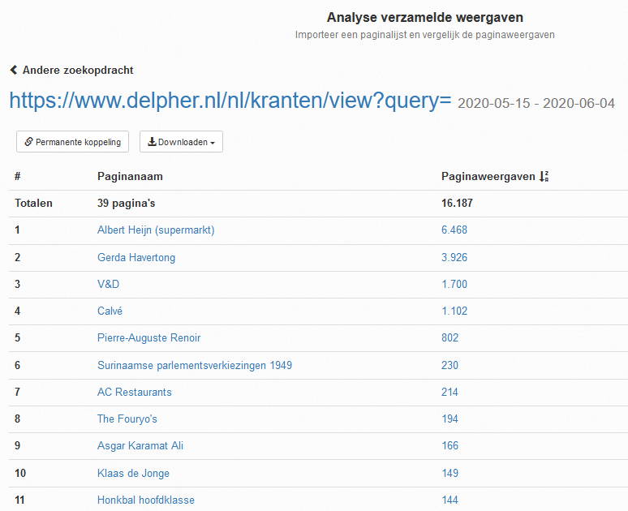</kbd>

This tool has one drawback however: you measure *that* an article contains links starting with that base URL, but not *which* links these exactly are, so what the *full URLs* look like.

Fortunately, there is another Wiki tool for this: [External links search](https://nl.wikipedia.org/w/index.php?title=Speciaal:VerwijzingenZoeken) (Dutch: *Externe koppelingen zoeken*). If you enter the above base URL in that tool, you will get [a list of all URLs starting with *https://www.delpher.nl/nl/kranten/view?query=*](https://nl.wikipedia.org/w/index.php?title=Speciaal:VerwijzingenZoeken&limit=1500&offset=0&target=https%3A%2F%2Fwww.delpher.nl%2Fnl%2Fkranten%2Fview%3Fquery%3D), and in which Dutch Wikipedia article each link appears.

<kbd>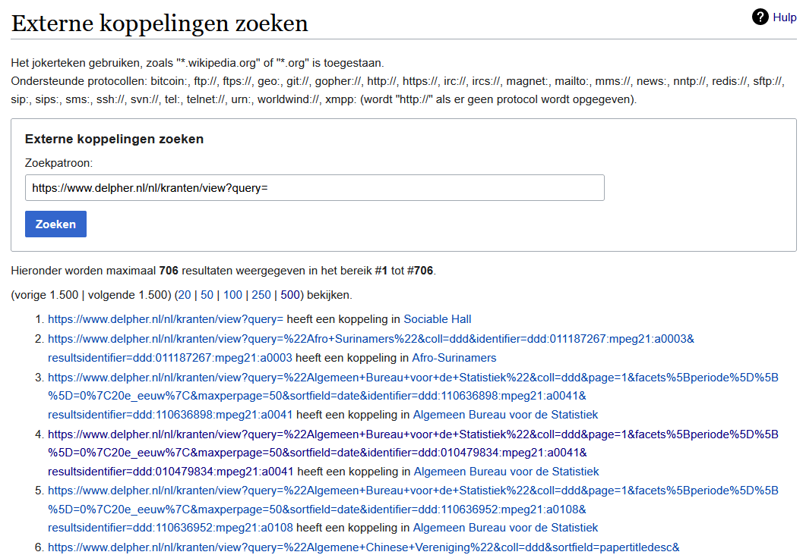</kbd>

To give an example: in line 2 about the [Afro-Surinamers](https://nl.wikipedia.org/wiki/Afro-Surinamers) you see that this article contains the link https://www.delpher.nl/nl/kranten/view?query=%22Afro+Surinamers%22&coll=ddd&identifier=ddd:011187267:mpeg21:a0003&resultsidentifier=ddd:011187267:mpeg21:a0003.
That link refers to the newspaper article 'Black Power' by Cyriel R. Karg in the *Vrije Stem: onafhankelijk weekblad voor Suriname* from 27-07-1970.

<kbd>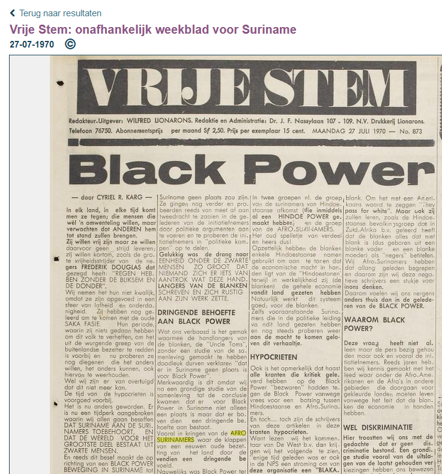</kbd>

And, indeed, in the Wikipedia article about the [Afro-Surinamers](https://nl.wikipedia.org/wiki/Afro-Surinamers)

<kbd>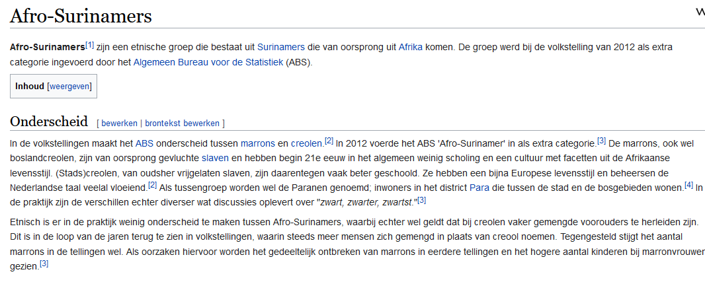</kbd>

see you that article and URL listed at the bottom. Check!

<kbd>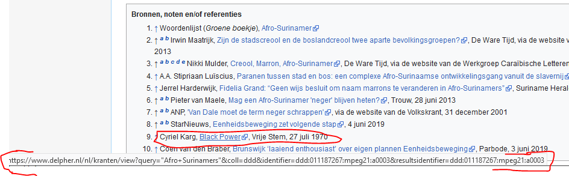</kbd>

### Making Delpher links in Wikipedia more sustainable (and shorter & nicer) ###
What struck me when working with this tool was that there are many Delpher links in Wikipedia that are non-persistent. The above link is an example of such an unsustainable link. Fortunately, you can often find the sustainable (= persistent, permanent, future-proof) link from the Delpher interface. In this example, it is https://resolver.kb.nl/resolve?urn=ddd:011187267:mpeg21:a0003, as shown in the screenshot below.

<kbd>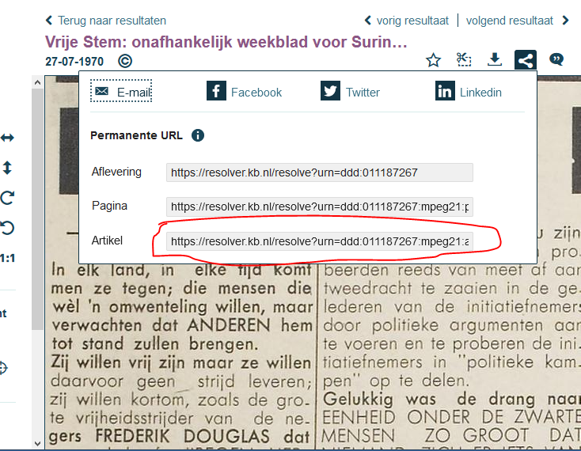</kbd>

Not only is this so-called resolver link (from the URL *resolver*.kb.nl) more future-proof, but it's also a lot shorter, more readable and 'cleaner' than that long, messy, non-permanent URL:

- Non-persistent: https://www.delpher.nl/nl/kranten/view?query=%22Afro+Surinamers%22&coll=ddd&identifier=ddd:011187267:mpeg21:a0003&resultsidentifier=ddd:011187267:mpeg21:a0003
- Persistent: https://resolver.kb.nl/resolve?urn=ddd:011187267:mpeg21:a0003.

#### Reusing scripts from 5 years ago ####
For these four reasons, it was a good idea to replace as many of those unsustainable URLs with persistent resolver links. Since Wikipedia currently contains [some 20,000 Delpher links](https://nl.wikipedia.org/wiki/Wikipedia:GLAM/Koninklijke_Bibliotheek_en_Nationaal_Archief/Resultaten/KPIs/KPI5/KPI5_KB_06-02-2020), a completely manual approach was not an option, so some automation was necessary.

Fortunately, years ago in 2015, following [a request from the KB](https://nl.wikipedia.org/w/index.php?title=Wikipedia:Verzoekpagina_voor_bots&oldid=44057475#Dode_URLs_(404s)_vervangen_in_artikelen_-_in_bulk_via_Excel-bestand), the Wikipedian [Merlijn van Deen](https://meta.wikimedia.org/wiki/User:Valhallasw) wrote a blog post on how to semi-automatically replace old, dead links to KB sites with new, working ones in Wikipedia. The [approach & scripts](https://web.archive.org/web/20200522204706/https://merlijn.vandeen.nl/2015/kb-replace-dead-links.html) he shared back then (after being shelfed for 5 years) suddenly came in very handy to get my job done!

I converted these scripts into [two Jupyter notebooks](https://paws-public.wmflabs.org/paws-public/User:OlafJanssenBot/WikipediaURLReplacement/ScriptsMerlijnVanDeen/scripts/) and using of some Excel work and the [replace.py](https://www.mediawiki.org/wiki/Manual:Pywikibot/replace.py) routine form the [Pywikibot framework](https://www.mediawiki.org/wiki/Manual:Pywikibot) I managed to make [hundreds of Delpher links more sustainable](https://nl.wikipedia.org/w/index.php?target=OlafJanssen&namespace=all&tagfilter=&start=2020-05-24&end=2020-05-25&limit=1400&title=Speciaal%3ABijdragen), as evidenced by the screenshot below.

<kbd>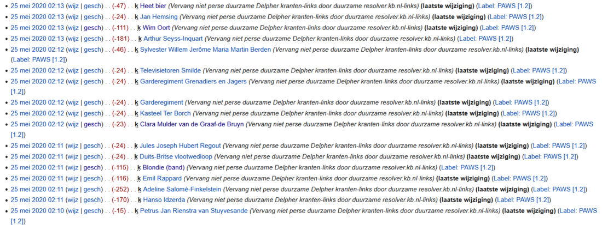</kbd>

#### Obvious effects ####
The effects of the actions can be clearly seen in thes source code of the affected articles, eg. in the one about the Dutch actress [Marijke Bakker](https://nl.wikipedia.org/w/index.php?title=Marijke_Bakker&type=revision&diff=56415987&oldid=55665879). That article has now become a lot shorter, more readable and tidier (left column = source code before the action, right column = source code after):

<kbd>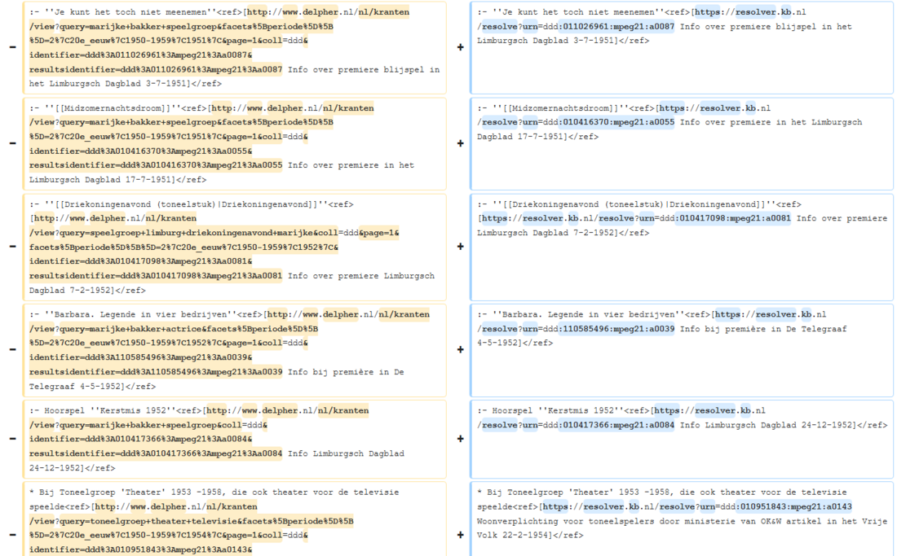</kbd>

Or in the article about [Europees clubhonkbal](https://nl.wikipedia.org/w/index.php?title=Europees_clubhonkbal&type=revision&diff=56423347&oldid=55994041) (European club baseball). That cleans up nicely!

<kbd>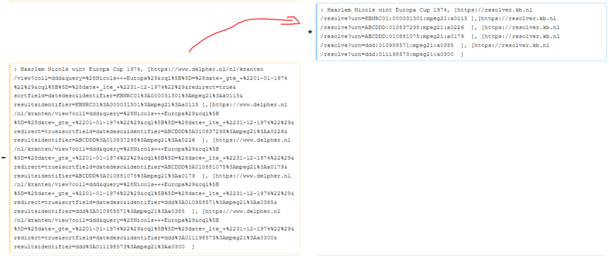</kbd>

### The benefits at a glance ###
To summarize, replacing non-persistent Delpher URLs with future-proof resolver links has following benefits, both for Wikipedia and the KB:
- **More sustainable**: because the KB guarantees the durability of its resolver URLs, those in Wikipedia will continue to work in the future, even if Delpher changes its name, domain or URL. As a result, this information from the KB will remain findable and referable in the years to come.
- **Shorter**: not only the URLs themselves get shorter, but also the Wikipedia articles in which they appear can do with less code, as is illustrated by the two screenshots above.
- **More uniform**: the KB resolver links are always structured in the same way; the first half is always *https://resolver.kb.nl/resolve?urn=* and the second half is always a compact, unique identifier such as *ddd: 011187267:mpeg21:a0003*, refering to a unique a newspaper article.
- **More beautiful & readable**: such uniform and short resolver links are a lot more readable than their non-durable counterparts, and look more beautiful in Wikicode.
- **Better machine-readable**: if you want to find, extract and process Delpher links from Wikipedia using scripts, tools or algorithms, it is very useful if those URLs have the same short, uniform syntax as much as possible, as is the case with resolver links. For example, think about finding and matching URLs using regular expressions.

### Making other KB services more sustainable ###
So far I've mainly worked on replacing links to Delpher (and specifically to newspapers). Once I've replaced all non-persistent newspaper links by their persistent equivalents, I'll start working on the books and magazines in Delpher. After that I will continue to replace non-durable links to other KB services with their resolver equivalents.

#### KB catalogue ###
A nice current example of the necessity of this is the recent change of the base URL of the KB catalogue. In June 2020 it changed from http://opc4.kb.nl to https://opc-kb.oclc.org/. For now, the KB offers a temporary redirect from the old to the new base URL, but once that stops, [hundreds of KB catalogue links](https://nl.wikipedia.org/w/index.php?title=Speciaal:VerwijzingenZoeken&limit=500&offset=0&target=http%3A%2F%2Fopc4.kb.nl) in Wikipedia (and other websites) are in danger of becoming unreachable.

To make those KB catalogue links really sustainable - after all, who will guarantee that https://opc-kb.oclc.org will still be available in 5 or 10 years' time? - it is best to replace them as much as possible with their durable resolver counterparts. These always take formats like https://resolver.kb.nl/resolve?urn=PPN:376299290, with the *PPN:number* uniquely identifying the publication in the catalogue.

This has already been done for about [1200 such links](https://nl.wikipedia.org/w/index.php?title=Speciaal:VerwijzingenZoeken/http://resolver.kb.nl/resolve%3Furn%3DPPN&limit=5000&offset=0&target=http%3A%2F%2Fresolver.kb.nl%2Fresolve%3Furn%3DPPN) (see screenshot below), but for the other links I will do this [in collaboration with the Wikipedia community](https://nl.wikipedia.org/w/index.php?title=Wikipedia:Verzoekpagina_voor_bots&oldid=56418809#Catalogus_Koninklijke_Bibliotheek).

<kbd>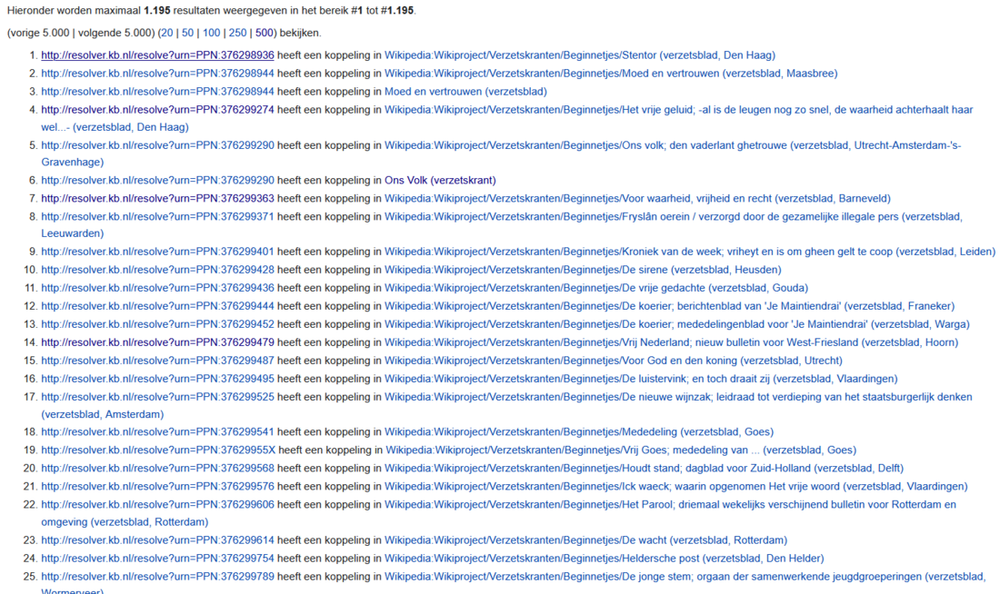</kbd>

### About the author

Olaf Janssen is the Wikimedia coordinator of the KB, the national library of the Netherlands. He contributes to
[Wikipedia](https://nl.wikipedia.org/wiki/Wikipedia:GLAM/Koninklijke_Bibliotheek_en_Nationaal_Archief), [Wikimedia Commons](https://commons.wikimedia.org/wiki/Category:Koninklijke_Bibliotheek) and [Wikidata](https://www.wikidata.org/wiki/Wikidata:GLAM/Koninklijke_Bibliotheek_Nederland) as [User:OlafJanssen](https://nl.wikipedia.org/wiki/Gebruiker:OlafJanssen) 

### Reusing this article
This text of this article is available under the [Creative Commons Attribution](https://creativecommons.org/licenses/by/4.0/) CC-BY 4.0 License. 
<kbd></kbd>
